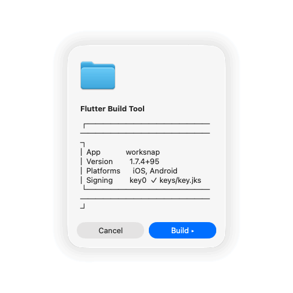

# Bumbuild

A native macOS build launcher for Flutter projects. Double-click to build, bump versions, and manage Android signing, no terminal needed.

<p align="center">
  
</p>

---

## Why Bumbuild?

Building a Flutter app for both stores shouldn't require juggling three tools. The typical release workflow means opening **Xcode** for iOS, **Android Studio** for signing setup, and the **terminal** to run `flutter build` and manually bump version numbers.

Bumbuild replaces all of that with a few clicks. Copy it into any Flutter project, double-click, and you're building. It handles the version bump, the keystore setup, the Gradle patching, and runs both platform builds, then opens the output folders when it's done.

No configuration. No dependencies. No terminal commands to memorize.

---

## Quick Start

1. **Download** the latest release from [the releases page](https://github.com/NickiAndersen/Bumbuild/releases), or clone this repo
2. **Copy** the `Bumbuild/` folder into the root of your Flutter project (next to `pubspec.yaml`)
3. **First launch only**: Double-click `Bumbuild.app`, macOS will block it. Then open **System Settings → Privacy & Security** and click **Open Anyway**.
4. Choose your platform and bump type, then click **Build Now**

```
my-flutter-app/
├── pubspec.yaml
├── lib/
├── ios/
├── android/
└── Bumbuild/              ← Copy here
    ├── Bumbuild.app       ← Double-click to launch
    └── keys/              ← Your keystores live here
```

> **Gatekeeper?** macOS blocks unsigned apps on first launch. After the first attempt to open, go to **System Settings → Privacy & Security** and click **Open Anyway** near the bottom of the panel. Confirm in the dialog, and the app will work with a double-click from then on.

---

## What It Does

| Step | Description |
|------|-------------|
| **Detect** | Reads `pubspec.yaml` in the parent directory and finds the app name, version, and available platforms |
| **Dashboard** | Shows a native dialog with your app's current version, iOS/Android availability, and signing status |
| **Platform** | Choose **iOS**, **Android**, or **Both** |
| **Version bump** | Choose from three options (see below) |
| **Signing gate** | If building for Android, the tool detects or sets up your release keystore automatically |
| **Build** | Opens a Terminal window and runs `flutter build` with live, color-coded output |
| **Notify** | Plays a system sound, shows a native popup, and opens the output folder when done |

---

## Version Bump Options

Bumbuild offers three bump choices in a clean, single-step dialog:

| Option | Example | When to use |
|--------|---------|-------------|
| **Rebuild** | `1.0.5+12` → `1.0.5+12` | Retrying a failed build, no version change |
| **New Version** | `1.0.5+12` → `1.0.6+13` | Daily builds, bug fixes, TestFlight uploads |
| **Custom** | Type any version | Major bumps, specific version numbers, full control |

**99 rollover:** When the patch number reaches 99, `New Version` automatically bumps the minor version and resets the patch to 0.

```
1.0.98+40 → New Version → 1.0.99+41
1.0.99+41 → New Version → 1.1.0+42   (auto minor bump)
```

---

## Android Signing

Bumbuild handles the entire Android release signing setup. No manual `keytool` commands, no editing `build.gradle` by hand.

### First Build

If `android/key.properties` doesn't exist, the tool walks you through:

1. **Create New**, generates a keystore in the `keys/` folder (saved automatically)
2. **Use Existing**, detects keystores already in the `keys/` folder
3. **Browse Other**, opens a file picker for keystores elsewhere on your machine (offers to copy into `keys/`)

After setup, the tool automatically:

- Creates `android/key.properties` with your credentials
- Patches `build.gradle` (or `build.gradle.kts`) with the signing configuration
- Verifies `signingConfigs.release` is used in both debug and release builds

### Subsequent Builds

The tool shows your current signing configuration and lets you continue or change keys.

### Security

> The `keys/` folder is **git-ignored**. Keystore files (`.jks`, `.keystore`, `.p12`, `.pepk`) are never committed to version control. Keep a secure backup of your keystore, it's required for all future Google Play Store updates.

---

## Requirements

| Tool | Purpose |
|------|---------|
| **macOS 10.15+** | Required platform |
| **Flutter SDK** | Must be in PATH (auto-detected from common locations) |
| **Xcode** | Required for iOS builds only |
| **Java JDK** | Required only when creating new Android keystores (`keytool`) |

No additional dependencies, package managers, or runtime environments needed.

---

## How It Works

Bumbuild is built entirely with **Bash** and **AppleScript**, no compiled code, no frameworks, no build step. Every component is a readable shell script.

1. `launch` validates the project and calls `gui.sh`
2. `gui.sh` presents the native dialogs, collects user choices, and orchestrates the flow
3. `build.sh` bumps the version in `pubspec.yaml`, runs `flutter build`, and reports results
4. `android_setup.sh` guides the user through keystore creation and Gradle configuration

The `keys/` folder travels with the tool, making it portable across projects and machines. Copy the entire `Bumbuild/` folder, keystores and all, into any Flutter project.

---

## Version History

| Version | Highlights |
|---------|------------|
| **v1.0** | Initial public release, three-choice bump (Rebuild / New Version / Custom), 99→minor rollover, version rollback on build failure, English UI |
